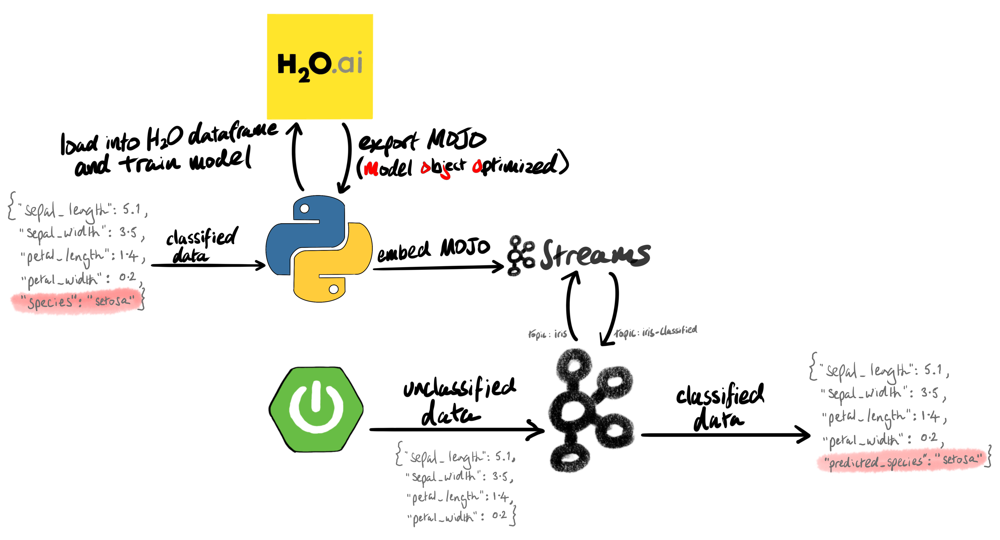
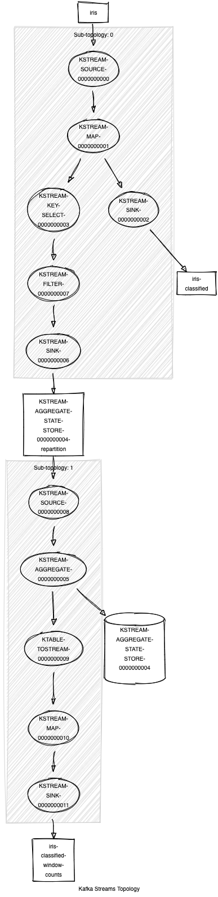

# Kafka Streams h2o example

The purpose of this project is to show how we can easily create a machine learning model and deploy it into production at scale.

This example is based on the famous [iris dataset](https://en.wikipedia.org/wiki/Iris_flower_data_set), which is a classic classification problem where four numerical covariates (i.e. petal/sepal lengths and widths) are used to predict the iris species (i.e. setosa, versicolor, and virginica).

There are two parts to this example:
1. a Java Spring app that randomly streams records from the iris dataset to a topic: `iris`.
2. a Kafka Streams app that consumes records from the `iris` topic, predicts the iris species, and outputs those preductions to another topic: `iris-classified`:

To run this in your environment, you'll want to edit the values in the following two properties files:
 - `kafka-iris-data/src/main/resources/application.properties`
 - `kstreams-iris-classification/src/main/resources/config.properties`

The ML model was generated using h2o's AutoML function in a few lines of Python:

    import h2o
    from h2o.automl import H2OAutoML
    
    h2o.init()
    iris = h2o.import_file('/Users/alex.woolford/iris.csv')
    
    train, test = iris.split_frame(ratios=[.8], seed=1234)
    
    x = train.columns
    y = "species"
    x.remove(y)
    
    aml = H2OAutoML(max_models=20, seed=1)
    aml.train(x=x, y=y, training_frame=train)
    
    lb = aml.leaderboard
    lb.head(rows=lb.nrows)
    
    aml.leader.download_mojo(path="/Users/alex.woolford/kstreams-h2o-example/kstreams-iris-classification/src/main/resources/", get_genmodel_jar=False)

The AutoML function takes a dataset, creates a variety of predictive models, and then compares the performance of those models in a leaderboard:

    model_id                                               mean_per_class_error    logloss      rmse        mse
    ---------------------------------------------------  ----------------------  ---------  --------  ---------
    DeepLearning_grid_1_AutoML_20190611_070229_model_2                0.0367021  0.165721   0.181637  0.0329919
    XRT_1_AutoML_20190611_070229                                      0.0379433  0.364826   0.181471  0.0329317
    GLM_grid_1_AutoML_20190611_070229_model_1                         0.0391844  0.0801216  0.15954   0.0254531
    DeepLearning_grid_1_AutoML_20190611_070229_model_1                0.0391844  0.231292   0.1915    0.0366723
    XGBoost_grid_1_AutoML_20190611_070229_model_4                     0.0404255  0.207108   0.222968  0.0497148
    XGBoost_1_AutoML_20190611_070229                                  0.0404255  0.217355   0.222782  0.0496319
    DRF_1_AutoML_20190611_070229                                      0.0450355  0.364836   0.181338  0.0328835
    StackedEnsemble_AllModels_AutoML_20190611_070229                  0.0462766  0.201319   0.217433  0.0472771
    GBM_grid_1_AutoML_20190611_070229_model_2                         0.0462766  0.424053   0.220497  0.048619
    StackedEnsemble_BestOfFamily_AutoML_20190611_070229               0.0462766  0.201696   0.21085   0.0444579
    GBM_3_AutoML_20190611_070229                                      0.0475177  0.149882   0.205184  0.0421004
    GBM_4_AutoML_20190611_070229                                      0.0475177  0.149882   0.205184  0.0421004
    XGBoost_grid_1_AutoML_20190611_070229_model_2                     0.0475177  0.186174   0.214231  0.0458951
    XGBoost_grid_1_AutoML_20190611_070229_model_1                     0.0475177  0.224382   0.229571  0.0527027
    XGBoost_3_AutoML_20190611_070229                                  0.0475177  0.313769   0.280067  0.0784375
    GBM_1_AutoML_20190611_070229                                      0.0475177  0.167198   0.207615  0.0431041
    GBM_2_AutoML_20190611_070229                                      0.0475177  0.149214   0.204935  0.0419982
    XGBoost_grid_1_AutoML_20190611_070229_model_3                     0.0475177  0.445682   0.362214  0.131199
    DeepLearning_grid_1_AutoML_20190611_070229_model_3                0.0530536  0.139576   0.205659  0.0422956
    GBM_grid_1_AutoML_20190611_070229_model_1                         0.0546099  0.208507   0.227649  0.0518243
    DeepLearning_1_AutoML_20190611_070229                             0.0746454  0.261534   0.270665  0.0732594
    XGBoost_2_AutoML_20190611_070229                                  0.0796099  0.522832   0.409302  0.167528

The most accurate model is then downloaded as a "MOJO" (Model ObJect, Optimized), and deployed in a Kafka Streams app.

The model outputs data to a couple of topics. `iris-classified` contains the predictions:

    # kafka-console-consumer --bootstrap-server localhost:9092 --topic iris-classified
    {"sepalLength":6.7,"sepalWidth":3.3,"petalLength":5.7,"petalWidth":2.5,"species":"virginica","predictedSpecies":"virginica"}
    {"sepalLength":6.5,"sepalWidth":3.0,"petalLength":5.5,"petalWidth":1.8,"species":"virginica","predictedSpecies":"virginica"}
    {"sepalLength":6.3,"sepalWidth":2.3,"petalLength":4.4,"petalWidth":1.3,"species":"versicolor","predictedSpecies":"versicolor"}
    {"sepalLength":5.8,"sepalWidth":4.0,"petalLength":1.2,"petalWidth":0.2,"species":"setosa","predictedSpecies":"setosa"}
    {"sepalLength":4.6,"sepalWidth":3.1,"petalLength":1.5,"petalWidth":0.2,"species":"setosa","predictedSpecies":"setosa"}

And `iris-classified-window-counts` shows per-minute counts for each actual/predicted pair:

    # kafka-console-consumer --bootstrap-server localhost:9092 --topic iris-classified-window-counts
    {"species":"versicolor","predictedSpecies":"virginica","startMs":1604302260000,"endMs":1604302320000,"count":1}
    {"species":"versicolor","predictedSpecies":"versicolor","startMs":1604302260000,"endMs":1604302320000,"count":10}
    {"species":"setosa","predictedSpecies":"setosa","startMs":1604302260000,"endMs":1604302320000,"count":14}
    {"species":"virginica","predictedSpecies":"virginica","startMs":1604302260000,"endMs":1604302320000,"count":19}

The Kafka Streams app can be scaled horizontally across multiple instances in order to meet whatever throughput is required.

Here's a diagram of the topology that was generated by the [Kafka Streams Topology Viewer](https://zz85.github.io/kafka-streams-viz/) tool:

See the demo in action:

